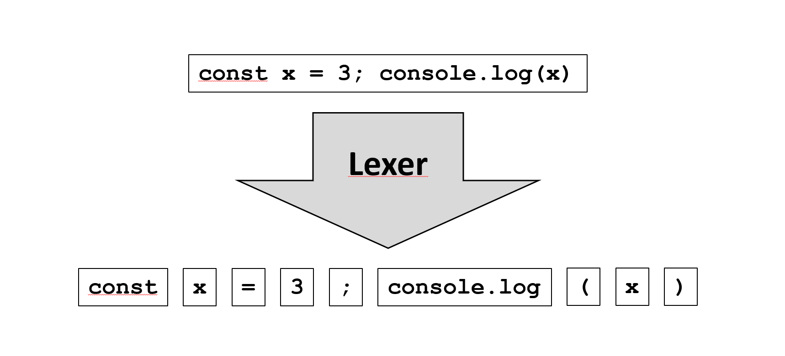

<div align="center">
    
  <h1>Lexer</h1>
  <p>
    Lexical Analyzer.
  </p>
</div>

https://en.wikipedia.org/wiki/Lexical_analysis

Why ? I wanted a SIMPLE, INTUITIVE, FAST, Full JS lexer, allowing to

- **tokenize correctly string and comment** in a language.
- **stropping** for being able to write not ambigous grammar in the next phase (syntax analysis)
- **use context** for being able to make off-side rules languages, etc.

Module useful for:

- compilers
- prettyprinters
- linters

## Install

```
npm i @jlguenego/lexer
```

[](https://github.com/google/gts)

## Usage

```js
const {Lexer, Group} = require('@jlguenego/lexer');

// Source code to tokenize.
const str = `
var x = 3;
var y = 52;
`;

// declare all the language rules.
const blank = new Rule({
  name: 'blank',
  pattern: /\s+/,
  ignore: true,
});

const keywords = Rule.createKeywordRules(['var']);

const operators = Rule.createGroupRules(Group.OPERATOR, [
  {
    name: 'equal',
    pattern: '=',
  },
]);

const separators = Rule.createGroupRules(Group.SEPARATOR, [
  {
    name: 'semi-column',
    pattern: ';',
  },
]);

const identifier = new Rule({
  name: 'identifier',
  pattern: /\w+/,
  group: Group.IDENTIFIER,
});

// the order is important. Token are applied from first to last.
const rules = [blank, ...keywords, ...operators, ...separators, identifier];

// Do the job.
const tokenSequence = new Lexer(rules).tokenize(str);

// print the output.
console.log('tokenSequence: ', tokenSequence);
```

This produces the following output:

```js
tokenSequence: [
  {
    name: 'var',
    lexeme: 'var',
    group: 'keywords',
    position: {col: 1, line: 2},
  },
  {
    name: 'identifier',
    lexeme: 'x',
    group: 'identifiers',
    position: {col: 5, line: 2},
  },
  {
    name: 'equal',
    lexeme: '=',
    group: 'operators',
    position: {col: 7, line: 2},
  },
  // ...
];
```

## examples

- See the [mocha test](./test/).

TODO:

- show example in famous language (JSON, XML, YAML, Javascript)

## Concepts

This module purpose is to tokenize a source code input.
In computer science, this process is known under the term
[lexical analysis](https://en.wikipedia.org/wiki/Lexical_analysis).
We call it also a **lexer**. The most famous lexer is flex, but this is designed for the C world.
Here we want a lexer in the javascript world.

`const tokenSequence = new Lexer(rules).tokenize(str);`

The above instruction applies `rules` to tokenize a source string `str`.

The rules are specified according the language and applied according a regular expression given in `rule.pattern`.

During tokenization we define by the word **state** the source code being tokenized.
The state is a sequence of two types of element:

- source code fragment, called **source element**, not yet tokenized,
- and recognized **token**.

At the beginning the state is an array of one **source element** reflecting the entire source code.
At the end the state must be an array of only tokens, otherwise the source code is not respecting the syntax.

Normally, the source code is tokenized from the beginning to the end of the string (called left to right scan) in one pass.
But tokenizing can be simpler if instead of looking from the beginning to the end,
we choose to apply successively one rule after another to the current state.
The drawback is that certains rules (for instance string, comment) cannot be well
correctly tokenized if they are nested together.

This parser does not contain any generators like flex.

Therefore this lexer do both algorithms successively in two passes:

1. **Preprocessing** pass: performs the slow and robust method with only the rules marked as preprocess flag.
2. **Main** pass: performs the fast way: applying the rules one after the other to the state.

The recommandation is to mark a rule with the preprocess flag only if the
main stage cannot apply the rule correctly. Of course if there is no rules with preprocess flag,
no need to run the preprocessing stage.

The preprocess stage applies all rules, and select the rule that will
apply at the smallest index of the source string.
It is slower than the main stage because there is many rules applied for finally only one selected.
The preprocess phase also allows to make rule for [stropping](<https://en.wikipedia.org/wiki/Stropping_(syntax)>).

The main stage applies one rule after the other. This means that the order of rules declaration are important.
For instance, the keyword rules should be applied from the longest one to the shortest one ([maximal munch rule](https://en.wikipedia.org/wiki/Maximal_munch))
The most generic one (identifer, type, etc.) must be applied with very low priority,
so it is recommanded to place them at the end of the rule list.

When a rule is applied, its method `expand` is executed. This method replaces the source element by an array of source elements and tokens.
Context is allowed for doing scenario like [off-side rule](https://en.wikipedia.org/wiki/Off-side_rule).

## Typescript

This module is written in Typescript and ready to be used in Typescript without separate typing module.

## Modules

This modules exports both a CommonJS module and ES2015 module.

## Thanks

- Thanks to https://refactoring.guru/ for helping me to refactor code, trying to produce something understandable for the non expert.
- Thanks to the other lexers I have visited on github. Specially the [chevrotain](https://github.com/SAP/chevrotain) lexer.
- Thanks to the people at Stanford University releasing for free their compiler course.
  I tried to speak with the same terminology in this lexer: https://web.stanford.edu/class/archive/cs/cs143/cs143.1128/

## Author

Made with :heart: by Jean-Louis GUENEGO <jlguenego@gmail.com>
